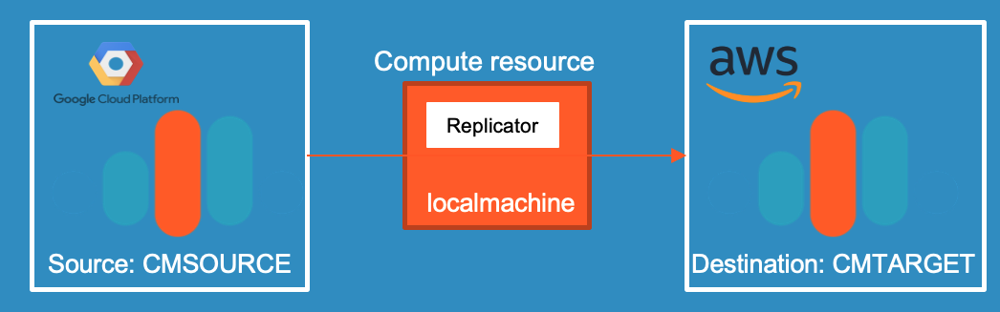

# Replicator show case

Fully automated demo showing replicating data from GCP Confluent Cloud to AWS Confluent Cloud.


This demo expects some preparation work, before you can execute the scripts. If all the preparation is done, then everything starts automatically:
* Confluent Platform 5.4 is installed locally
* confluent cloud cli is installed locally
* iterm2 with "install shell integration enables (see iterm2->Install Shell integration)" is installed
* A Confluent Cloud Account have to be created
* An environment in Confluent Cloud have to be created and named in the script
* Schema Registry has to be enabled for Confluent Cloud Environment

## Pre-Configure
the shell script `env-vars` has some variables which need to fit to your Confluent Cloud environment
* Your Confluent Cloud Environment ID:  XX_CCLOUD_ENV=XXXXXX
  The Confluent Cloud Environment ID can be listed via `ccloud environment list`
* Your Confluent Cloud Login: XX_CCLOUD_EMAIL=YYYYYYY
* Your Confluent Cloud Password: XX_CCLOUD_PASSWORD=ZZZZZZZZZ
* The name for the Source Confluent Cluster: XX_CCLOUD_CLUSTERNAME1=SOURCEGCP
* The name for the Target Confluent Cluster: XX_CCLOUD_CLUSTERNAME2=TARGETAWS
* Please be sure that `CONFLUENT_HOME and PATH` is set in `.bashrc or .bash_profile` so that in terminal confluent tools can be executed 


## Start the demo showcase
Start the demo
```bash
source env-vars
./00_create_ccloudcluster.sh
```
iterm Terminals with replictor, producer and consumer start automatically. 
* Now you enter data into the producer
* you will see that reading from source and target is with less difference, almost real-time. 
* You can login into your Confluent Cloud Account and check in GUI:
  * Dataflow
  * Topic
Note: It will take a while till everything working fine in GUI.

## Stop the demo showcase
To delete the complete environment:
```bash
./02_drop_ccloudcluster.sh
```


